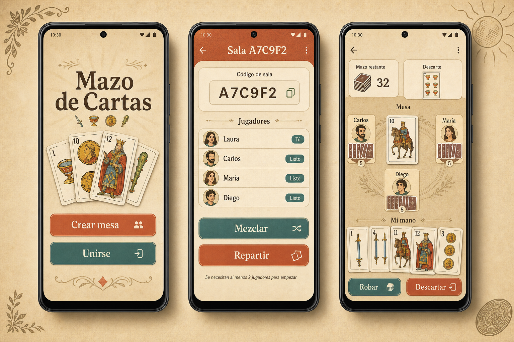
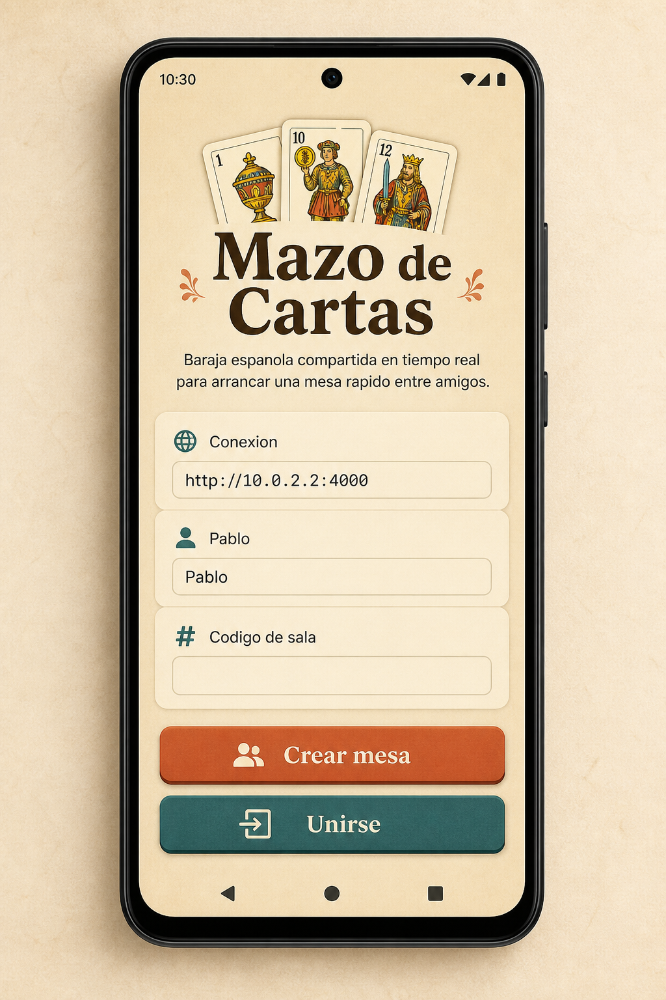
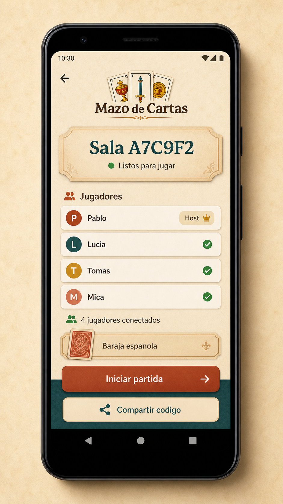
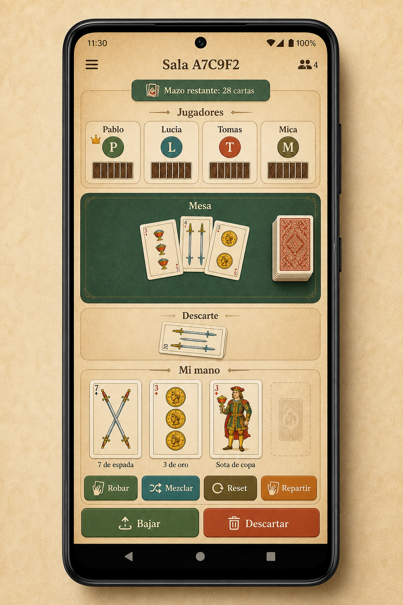

# Mazo de Cartas

Mazo de Cartas is an Android-first MVP for sharing a Spanish deck in real time between friends. The app provides temporary rooms, private hands per player, a shared table, and host-controlled deck actions without implementing the rules of any specific card game.

## UI Preview



### Screens

**Create or join a room**



**Lobby**



**Active table**



## MVP Scope

Included in this version:
- Temporary online rooms with room-code join
- One Spanish deck per room
- Host actions for shuffle, deal, and reset
- Player actions for draw, play to table, and discard
- Private hand visibility and shared table/discard visibility
- Android client runnable in Expo and a local Node realtime backend

Explicitly out of scope:
- Truco, Escoba, Casita Robada, or any game-specific rules
- Scoring or match history
- Offline, Bluetooth, or proximity mode
- Alternate deck types
- Accounts, friends, or persistent identity

## Project Structure

- `src/`: Expo React Native client
- `server/`: authoritative Node/TypeScript session backend
- `shared/`: session types shared by client and server
- `openspec/changes/add-shared-spanish-deck-mvp/`: proposal, design, spec, and tasks for this MVP

## Run Locally

1. Install dependencies:

```bash
npm install
```

2. Start the backend:

```bash
npm run server
```

3. Start the Expo app:

```bash
npm start
```

4. Open the app in an Android emulator or Expo Go.

Default local server URL in the app is `http://10.0.2.2:4000`, which works for the Android emulator. For a physical device, replace it with your machine's LAN URL, for example `http://192.168.1.20:4000`.

## Validation

Backend tests:

```bash
npm test
```

TypeScript compile check:

```bash
npx tsc --noEmit
```
